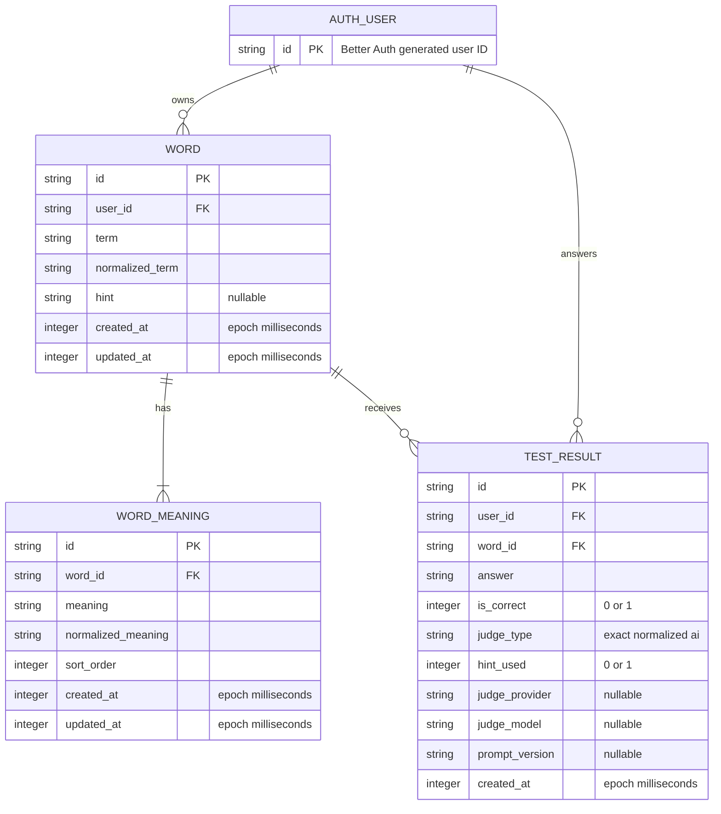

# DB設計: Tango MVP

> 状態: **レビュー待ち／認証schema生成とOQ-009決定前**
> 採用DB: Cloudflare D1（SQLite互換）
> ORM/migration: Drizzle ORM / Drizzle Kit

## 1. 概要・設計方針

単語、複数意味、回答履歴、認証情報の永続化が必要なためDB設計を行う。アプリ固有データは第3正規形を基調とし、回答履歴を事実の正本、正解率を派生値とする。

重要方針:

- Better Authの物理テーブルは採用versionのCLIで生成し、本書で手作業推測しない。
- アプリ固有テーブルはBetter Auth user IDを所有者FKとして参照する。
- 単語と複数意味の作成・置換更新はD1 `batch()`で原子的に行う。
- 全所有データqueryに`user_id`を含める。
- 統計は`test_results`から算出し、初期schemaに集計cacheを持たない。
- 単語削除と履歴の関係はOQ-009が未決のため、初期案では履歴のあるwordを`RESTRICT`し、公開削除機能の実装前に最終方針を決める。

## 2. ER図

`AUTH_USER`はBetter Auth生成user tableを表す**概念上の別名**であり、実際のtable/column名はT02で生成されたschemaへ置き換える。



## 3. テーブル定義

### 3.1 Better Auth管理テーブル

役割: user、session、OAuth account、verification等をBetter Authが管理する。

設計ルール:

1. `better-auth@<locked-version>` と採用adapterを構成する。
2. `npx auth@latest generate`を盲目的に使わず、lockしたCLI/versionでschemaを生成する。
3. 生成されたDrizzle schemaとSQL migrationをレビューし、本書の概念`AUTH_USER.id`を実名へ更新する。
4. Google OAuthに不要なplugin/tableを追加しない。
5. 認証schemaの手修正が必要なら、Better Authの期待するmodel/field mappingも同時に更新する。

生成前のため物理カラム一覧はここに記載しない。この未記載は設計漏れではなく、原典の「手作業で推測しない」を守るための意図的な保留である。

### 3.2 `words`

役割: ユーザーが登録した英単語と任意ヒントを保持する。

| column | D1/Drizzle型 | NULL | constraint/key | 説明 |
|---|---|---:|---|---|
| `id` | `text` | No | PK | application生成opaque ID |
| `user_id` | `text` | No | FK → Better Auth user ID | 所有ユーザー |
| `term` | `text` | No | CHECK trim後長さ > 0 | 表示用原文 |
| `normalized_term` | `text` | No | CHECK length > 0 | NFKC等の決定済み規則による検索値 |
| `hint` | `text` | Yes | 文字数はOQ-018 | 任意ヒント。空文字はNULLへ正規化 |
| `created_at` | `integer` | No | epoch ms | 作成日時 |
| `updated_at` | `integer` | No | epoch ms | 更新日時 |

table constraints:

- `UNIQUE(id, user_id)` — `test_results(word_id, user_id)`の複合FKで所有者一致をDBでも保証する。
- `normalized_term`はOQ-008未決のためUNIQUEにしない。初期設計は重複をDBで禁止しない。

indexes:

- `idx_words_user_created` on `(user_id, created_at DESC, id)` — 一覧・cursor。
- `idx_words_user_normalized_term` on `(user_id, normalized_term)` — 重複照合・将来検索。

### 3.3 `word_meanings`

役割: 1単語に属する1件以上の日本語の意味を表示順付きで保持する。

| column | D1/Drizzle型 | NULL | constraint/key | 説明 |
|---|---|---:|---|---|
| `id` | `text` | No | PK | meaning ID |
| `word_id` | `text` | No | FK → `words.id` ON DELETE CASCADE | 親単語 |
| `meaning` | `text` | No | CHECK trim後長さ > 0 | 表示用原文 |
| `normalized_meaning` | `text` | No | CHECK length > 0 | exact後のnormalized比較値 |
| `sort_order` | `integer` | No | CHECK `sort_order >= 0` | 0始まりの表示順 |
| `created_at` | `integer` | No | epoch ms | 作成日時 |
| `updated_at` | `integer` | No | epoch ms | 更新日時 |

constraints/indexes:

- `UNIQUE(word_id, sort_order)` — 同一word内の表示順重複を防ぐ。
- `idx_word_meanings_word_order` on `(word_id, sort_order)` — 親から順序付き取得。
- 「親に最低1件」は行単体のCHECK/FKで表現できない。application validationと、word+meaningを同一D1 batchで書くことで保証する。
- 同じnormalized meaningの重複をDBでは禁止しない。UIでの重複候補警告はOQ-008と合わせて決める。

### 3.4 `test_results`

役割: 1回の回答という不変の事実を保持する。更新を基本とせずappend-onlyに扱う。

| column | D1/Drizzle型 | NULL | constraint/key | 説明 |
|---|---|---:|---|---|
| `id` | `text` | No | PK | result ID |
| `user_id` | `text` | No | FK → Better Auth user ID | 回答ユーザー |
| `word_id` | `text` | No | FK → `words.id` | 出題単語 |
| `answer` | `text` | No | CHECK trim後長さ > 0 | ユーザー入力原文 |
| `is_correct` | `integer` | No | CHECK IN (0,1) | 最終正誤 |
| `judge_type` | `text` | No | CHECK IN (`exact`,`normalized`,`ai`) | 決着した判定段階 |
| `hint_used` | `integer` | No | DEFAULT 0, CHECK IN (0,1) | ヒント利用 |
| `judge_provider` | `text` | Yes |  | AI判定時のprovider ID |
| `judge_model` | `text` | Yes |  | AI判定時のmodel ID |
| `prompt_version` | `text` | Yes |  | AI判定prompt schema version |
| `created_at` | `integer` | No | epoch ms | 回答日時 |

constraints:

- `FOREIGN KEY (word_id, user_id) REFERENCES words(id, user_id) ON DELETE RESTRICT` — result ownerとword ownerの不一致をDBでも拒否する。
- `judge_type != 'ai'`の場合、provider/model/promptをNULLにするのをapplication invariantとする。D1 CHECKへも反映するかはmigration PoCで検証する。
- AIの手動修正機能はMVP未採用のため、`ai_judgement`や`final_judgement`を作らない。採用時は監査履歴を含む別設計にする。

indexes:

- `idx_test_results_user_created` on `(user_id, created_at DESC, id)` — 履歴cursor。
- `idx_test_results_user_word_created` on `(user_id, word_id, created_at DESC)` — 単語別集計・直近履歴。
- `idx_test_results_word_correct` on `(word_id, is_correct)` は上記で不足することをquery planで確認してから追加し、先回りしない。

## 4. リレーションとカーディナリティ

- Better Auth user 1 : N words。userは0件のwordを持てる。
- word 1 : N word_meanings。アプリ上は必ず1件以上。
- Better Auth user 1 : N test_results。
- word 1 : N test_results。未回答wordは0件。
- `test_results.user_id`と`word_id`は複合FKで同一所有者を保証する。

## 5. 正規化・非正規化

### 5.1 正規化

- 複数意味は繰り返し列やJSONへ埋め込まず、`word_meanings`へ分離する。
- 履歴は`test_results`へ分離する。
- 統計は履歴から導出し、`words.correct_count`等を持たない。

### 5.2 意図的な重複

- `test_results.user_id`は`word_id`から導出可能だが、要件で履歴にuser IDが必要であり、owner scope queryと将来の保持方針を安全にするため保持する。
- `normalized_term` / `normalized_meaning`は原文から導出可能だが、検索・比較の一貫性と将来の重複照合のため保存する。
- 正規化algorithmを変更する場合はversion差を放置せず、全行再計算migrationまたはversion column追加を設計する。

## 6. インデックス設計とquery

### 6.1 単語一覧＋統計

```sql
SELECT
  w.id,
  w.term,
  COUNT(tr.id) AS total,
  COALESCE(SUM(tr.is_correct), 0) AS correct
FROM words w
LEFT JOIN test_results tr
  ON tr.word_id = w.id AND tr.user_id = w.user_id
WHERE w.user_id = ?
GROUP BY w.id
ORDER BY w.created_at DESC, w.id DESC
LIMIT ?;
```

意味は対象word ID群に対する2本目のqueryで取得し、巨大なjoin resultとN+1の両方を避ける。実際のDrizzle生成SQLに`EXPLAIN QUERY PLAN`を実行する。

### 6.2 苦手優先

所有ユーザーのwordごとに`total`と`correct`を集計し、applicationの`WeaknessWeightPolicy`で正の重みを算出する。OQ-006で式を決定するまでSQLへ埋め込まない。

### 6.3 cursor

同値時の安定順序を保証するため、`created_at`単独でなく`(created_at,id)`をcursorにする。cursorはbase64url等でopaque化し、内容をvalidationする。

## 7. 制約・整合性・規模

- D1はFKを常時強制するため、migrationで一時的に順序変更が必要な場合は公式の`PRAGMA defer_foreign_keys`を利用する。
- D1 `batch()`は途中失敗でsequence全体をrollbackする。単語と意味の作成・置換更新に使う。
- D1は1DB最大Paid 10GB / Free 500MB（2026-08-20調査値）で、single-threadedにqueryを処理する。OQ-012の件数・同時利用が決まり次第、1件あたり実測容量とp95を計測する。
- 意味0件、入力上限、正規化、AI metadata条件はapplicationとintegration testで守り、表現可能なものだけDB CHECKでも二重化する。
- ID衝突、時計の逆行、batch失敗をテストする。

## 8. 削除・保持方針

### 8.1 確定しているもの

- `word_meanings`はwordの構成要素なので、word削除時にcascadeしてよい。
- test resultをユーザーが個別編集・削除する機能はMVP要件にない。

### 8.2 未決（OQ-009）

| 案 | 長所 | 短所 | schema影響 |
|---|---|---|---|
| cascade delete | 単純、完全削除 | 学習履歴を失う | `test_results`をON DELETE CASCADE |
| soft delete word | 履歴・統計を保持 | 一覧scopeと保持期限が複雑 | `words.deleted_at`追加 |
| resultへsnapshotしword参照をNULL化 | 履歴保持とhard delete | schema・表示ロジックが増える | nullable FK + term/meaning snapshot |

初期migration候補は`RESTRICT`とし、履歴ありwordのDELETE endpointをOQ-009決定前に公開しない。決定後に本節・ER図・migrationを更新する。

## 9. Migration・初期データ

1. Better Authのlock versionで認証schemaを生成しレビューする。
2. Drizzle schemaからSQL migrationを生成する。
3. local D1へ適用し、FK、CHECK、index、batch rollbackをWorkers integration testで検証する。
4. preview D1へ同じmigrationを適用し、Google OAuth/sessionとCRUDを確認する。
5. production適用前にTime Travel/backup方針とrollback手順を確認する。

ルール:

- 適用済みmigrationを改変せず、新しい連番migrationを追加する。
- productionで`drizzle push`による無審査同期を使わない。
- seedは架空データだけとし、個人情報・実tokenを含めない。
- normalized algorithm変更はデータmigrationと再計算testを伴う。

## 10. 要件との対応

| 要件 | schema/constraint |
|---|---|
| AUTH-003 | 全app tableのowner FK、words/test_resultsの複合owner FK |
| WORD-001/002 | words + word_meanings、意味1件以上をapplication+batchで保証 |
| WORD-003 | user/index、meanings order、test_results集計 |
| HINT-001/003 | words.hint、test_results.hint_used |
| JUDGE-002〜004 | normalized_meaning、judge_type、AI metadata |
| JUDGE-005 | acceptable_answers tableなし、accepted値なし |
| HISTORY-001 | test_resultsの必須列 |
| HISTORY-002 | test_results集計、0件はLEFT JOINで識別 |

## 11. 参照

- [Cloudflare D1 foreign keys](https://developers.cloudflare.com/d1/sql-api/foreign-keys/)
- [Cloudflare D1 batch](https://developers.cloudflare.com/d1/worker-api/d1-database/)
- [Cloudflare D1 limits](https://developers.cloudflare.com/d1/platform/limits/)
- [Drizzle ORM Cloudflare D1](https://orm.drizzle.team/docs/sqlite/connect-cloudflare-d1)
- [Better Auth Drizzle adapter](https://better-auth.com/docs/adapters/drizzle)

## 12. 更新履歴

- 2026-08-20 初版作成
