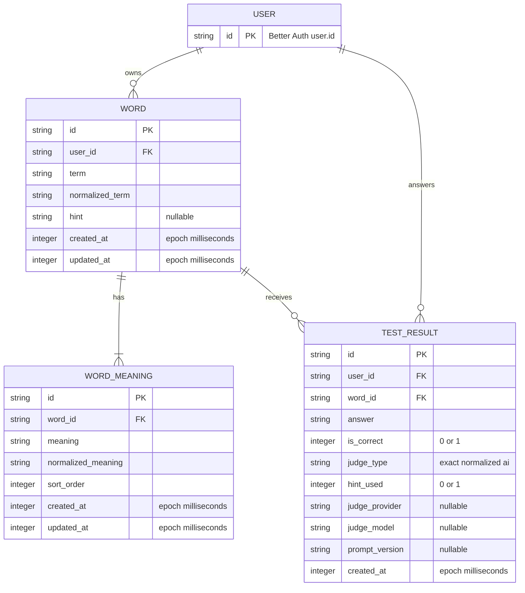

# DB設計: Tango MVP

> 状態: **T06で一覧queryのplanを実測し、ページ確定と統計集計を分離。OQ-008/009決定済みだが、対応migrationは未適用（9.1）。**
> 採用DB: Cloudflare D1（SQLite互換）
> ORM/migration: Drizzle ORM / Drizzle Kit

## 1. 概要・設計方針

単語、複数意味、回答履歴、認証情報の永続化が必要なためDB設計を行う。アプリ固有データは第3正規形を基調とし、回答履歴を事実の正本、正解率を派生値とする。

重要方針:

- Better Authの物理テーブルは採用versionのCLIで生成し、本書で手作業推測しない。
- アプリ固有テーブルはBetter Auth user IDを所有者FKとして参照する。
- 単語と複数意味の作成・置換更新はD1 `batch()`で原子的に行う。
- 全所有データqueryに`user_id`を含める。
- 統計は`test_results`から算出し、初期schemaに集計cacheを持たない。
- 単語削除と履歴の関係はOQ-009が未決のため、初期migrationは履歴のあるwordを`RESTRICT`し、公開DELETE endpointは作らない。

## 2. ER図

`user` は Better Auth CLI（`auth@1.7.1`）が生成した認証ユーザーテーブルである。アプリテーブルの所有者FKは `user.id` を参照する。



## 3. テーブル定義

### 3.1 Better Auth管理テーブル

役割: user、session、OAuth account、verificationをBetter Authが管理する。物理名は `better-auth@1.7.1` / `auth@1.7.1 generate` の出力であり、手で推測・改変していない。生成物は `src/infrastructure/db/schema/auth.generated.ts` と `drizzle/0000_calm_lady_deathstrike.sql`。

設計ルール:

1. `better-auth@1.7.1` と `@better-auth/drizzle-adapter@1.7.1` を構成する。
2. `npx auth@latest generate`を盲目的に使わず、lockした `auth@1.7.1` でschemaを生成する。
3. Google OAuthに不要なplugin/tableを追加しない。
4. 認証schemaの手修正が必要なら、Better Authの期待するmodel/field mappingも同時に更新する。
5. アプリテーブルの時刻はepoch millisecondsのintegerで統一する。認証テーブルはCLI出力どおり `timestamp_ms`（SQL integer + `unixepoch('subsecond')`）を維持し、アプリ側でBetter Auth内部表現へ変換しない。

#### `user`

| column | D1/Drizzle型 | NULL | constraint/key | 説明 |
|---|---|---:|---|---|
| `id` | `text` | No | PK | Better Auth生成のユーザーID。アプリの所有者FK |
| `name` | `text` | No |  | Googleプロフィール名 |
| `email` | `text` | No | UNIQUE | ログイン識別 |
| `email_verified` | `integer` (boolean) | No | DEFAULT false | Google連携時の検証状態 |
| `image` | `text` | Yes |  | プロフィール画像URL |
| `created_at` | `integer` (timestamp_ms) | No | DEFAULT unixepoch('subsecond') | 作成日時 |
| `updated_at` | `integer` (timestamp_ms) | No | DEFAULT unixepoch('subsecond') | 更新日時 |

#### `session`

| column | D1/Drizzle型 | NULL | constraint/key | 説明 |
|---|---|---:|---|---|
| `id` | `text` | No | PK | session ID |
| `expires_at` | `integer` (timestamp_ms) | No |  | 期限 |
| `token` | `text` | No | UNIQUE | Cookieと対応するsession token |
| `created_at` | `integer` (timestamp_ms) | No | DEFAULT unixepoch('subsecond') | 作成日時 |
| `updated_at` | `integer` (timestamp_ms) | No |  | 更新日時 |
| `ip_address` | `text` | Yes |  | 任意 |
| `user_agent` | `text` | Yes |  | 任意 |
| `user_id` | `text` | No | FK → `user.id` ON DELETE CASCADE | 所有者 |

indexes: `session_userId_idx` on (`user_id`)。

#### `account`

Google OAuthの連携アカウント。`password` はCLI出力に含まれるが、MVPのGoogleログインでは使わない。

| column | D1/Drizzle型 | NULL | constraint/key | 説明 |
|---|---|---:|---|---|
| `id` | `text` | No | PK | account ID |
| `issuer` | `text` | No | UNIQUE with `account_id` | IdP issuer |
| `account_id` | `text` | No | UNIQUE with `issuer` | provider側アカウントID |
| `provider_id` | `text` | No |  | 例: `google` |
| `user_id` | `text` | No | FK → `user.id` ON DELETE CASCADE | アプリユーザー |
| `access_token` | `text` | Yes |  | OAuth access token。ログ禁止 |
| `refresh_token` | `text` | Yes |  | OAuth refresh token。ログ禁止 |
| `id_token` | `text` | Yes |  | OAuth ID token。ログ禁止 |
| `access_token_expires_at` | `integer` (timestamp_ms) | Yes |  | access token期限 |
| `refresh_token_expires_at` | `integer` (timestamp_ms) | Yes |  | refresh token期限 |
| `scope` | `text` | Yes |  | 付与scope |
| `password` | `text` | Yes |  | パスワード認証用。GoogleのみのMVPでは未使用 |
| `created_at` | `integer` (timestamp_ms) | No | DEFAULT unixepoch('subsecond') | 作成日時 |
| `updated_at` | `integer` (timestamp_ms) | No |  | 更新日時 |

indexes: `account_issuer_accountId_uidx` unique on (`issuer`,`account_id`)、`account_userId_idx` on (`user_id`)。

#### `verification`

メール検証やOAuth中間stateなど、Better Authが短命トークンを置くテーブル。

| column | D1/Drizzle型 | NULL | constraint/key | 説明 |
|---|---|---:|---|---|
| `id` | `text` | No | PK | verification ID |
| `identifier` | `text` | No |  | 検証対象の識別子 |
| `value` | `text` | No |  | 検証値。ログ禁止 |
| `expires_at` | `integer` (timestamp_ms) | No |  | 期限 |
| `created_at` | `integer` (timestamp_ms) | No | DEFAULT unixepoch('subsecond') | 作成日時 |
| `updated_at` | `integer` (timestamp_ms) | No | DEFAULT unixepoch('subsecond') | 更新日時 |

indexes: `verification_identifier_idx` on (`identifier`)。

### 3.2 `words`

役割: ユーザーが登録した英単語と任意ヒントを保持する。

| column | D1/Drizzle型 | NULL | constraint/key | 説明 |
|---|---|---:|---|---|
| `id` | `text` | No | PK | application生成opaque ID |
| `user_id` | `text` | No | FK → `user.id` | 所有ユーザー |
| `term` | `text` | No | CHECK trim後長さ > 0 | 表示用原文 |
| `normalized_term` | `text` | No | CHECK length > 0 | NFKC等の決定済み規則による検索値 |
| `hint` | `text` | Yes |  | 任意ヒント。空文字はNULLへ正規化。上限500文字はDB CHECKに持たずapplicationで守る |
| `created_at` | `integer` | No | epoch ms | 作成日時 |
| `updated_at` | `integer` | No | epoch ms | 更新日時 |

table constraints:

- `UNIQUE(id, user_id)` — `test_results(word_id, user_id)`の複合FKで所有者一致をDBでも保証する。
- `UNIQUE(user_id, normalized_term)` — OQ-008決定によりユーザー単位の重複登録を禁止する。**未適用**。`0001_minor_wasp` は制約なしで適用済みのため、新しいmigrationで追加する（9章）。
- 重複判定の真値はこのUNIQUE制約。applicationの事前照合は分かりやすいエラーのためであり、同時実行で抜けた分はUNIQUE違反を捕まえて `409` へ変換する。

indexes:

- `idx_words_user_created` on `(user_id, created_at, id)` — 一覧・cursor。DDLはASCで作る。SQLiteは同じindexを逆順に走査できるため、`ORDER BY created_at DESC, id DESC` でもDESC指定は不要。
- `idx_words_user_normalized_term` on `(user_id, normalized_term)` — 重複照合・将来検索。`UNIQUE(user_id, normalized_term)` を追加したら同一列構成になるため、UNIQUE index側へ統合してこの非UNIQUE indexは削除する。

### 3.3 `word_meanings`

役割: 1単語に属する1件以上の日本語の意味を表示順付きで保持する。

| column | D1/Drizzle型 | NULL | constraint/key | 説明 |
|---|---|---:|---|---|
| `id` | `text` | No | PK | meaning ID |
| `word_id` | `text` | No | FK → `words.id` ON DELETE CASCADE | 親単語 |
| `meaning` | `text` | No | CHECK trim後長さ > 0 | 表示用原文 |
| `normalized_meaning` | `text` | No | CHECK length > 0 | exact後のnormalized比較値 |
| `sort_order` | `integer` | No | CHECK `sort_order >= 0` | 0始まりの表示順 |
| `created_at` | `integer` | No | epoch ms | 作成日時 |
| `updated_at` | `integer` | No | epoch ms | 更新日時 |

constraints/indexes:

- `UNIQUE(word_id, sort_order)` — 同一word内の表示順重複を防ぐ。
- `idx_word_meanings_word_order` on `(word_id, sort_order)` — 親から順序付き取得。
- 「親に最低1件」は行単体のCHECK/FKで表現できない。application validationと、word+meaningを同一D1 batchで書くことで保証する。
- 同じnormalized meaningの重複はDBでもUIでも禁止しない。OQ-008で禁止したのは `words.normalized_term` だけで、意味は対象外。

### 3.4 `test_results`

役割: 1回の回答という不変の事実を保持する。更新を基本とせずappend-onlyに扱う。

| column | D1/Drizzle型 | NULL | constraint/key | 説明 |
|---|---|---:|---|---|
| `id` | `text` | No | PK | result ID |
| `user_id` | `text` | No | FK → `user.id` | 回答ユーザー |
| `word_id` | `text` | No | FK → `words.id` | 出題単語 |
| `answer` | `text` | No | CHECK trim後長さ > 0 | ユーザー入力原文 |
| `is_correct` | `integer` | No | CHECK IN (0,1) | 最終正誤 |
| `judge_type` | `text` | No | CHECK IN (`exact`,`normalized`,`ai`) | 決着した判定段階 |
| `hint_used` | `integer` | No | DEFAULT 0, CHECK IN (0,1) | ヒント利用 |
| `judge_provider` | `text` | Yes |  | AI判定時のprovider ID |
| `judge_model` | `text` | Yes |  | AI判定時のmodel ID |
| `prompt_version` | `text` | Yes |  | AI判定prompt schema version |
| `created_at` | `integer` | No | epoch ms | 回答日時 |

constraints:

- `FOREIGN KEY (word_id, user_id) REFERENCES words(id, user_id) ON DELETE CASCADE` — result ownerとword ownerの不一致をDBでも拒否し、word削除時に履歴も消す。OQ-009の決定による。**未適用**。`0001_minor_wasp` は `ON DELETE RESTRICT` で適用済みのため、新しいmigrationで置き換える（9章）。
- `judge_type != 'ai'`の場合、provider/model/promptをNULLにする。T03のmigrationでCHECK `test_results_ai_metadata` として二重化した。
- AIの手動修正機能はMVP未採用のため、`ai_judgement`や`final_judgement`を作らない。採用時は監査履歴を含む別設計にする。

indexes:

- `idx_test_results_user_created` on `(user_id, created_at, id)` — 履歴cursor。
- `idx_test_results_user_word_created` on `(user_id, word_id, created_at)` — 単語別集計・直近履歴。
- `idx_test_results_word_correct` on `(word_id, is_correct)` は上記で不足することをquery planで確認してから追加し、先回りしない。

## 4. リレーションとカーディナリティ

- Better Auth `user` 1 : N words。userは0件のwordを持てる。
- word 1 : N word_meanings。アプリ上は必ず1件以上。
- Better Auth `user` 1 : N test_results。
- word 1 : N test_results。未回答wordは0件。
- `test_results.user_id`と`word_id`は複合FKで同一所有者を保証する。

## 5. 正規化・非正規化

### 5.1 正規化

- 複数意味は繰り返し列やJSONへ埋め込まず、`word_meanings`へ分離する。
- 履歴は`test_results`へ分離する。
- 統計は履歴から導出し、`words.correct_count`等を持たない。

### 5.2 意図的な重複

- `test_results.user_id`は`word_id`から導出可能だが、要件で履歴にuser IDが必要であり、owner scope queryと将来の保持方針を安全にするため保持する。
- `normalized_term` / `normalized_meaning`は原文から導出可能だが、検索・比較の一貫性と将来の重複照合のため保存する。
- 正規化algorithmを変更する場合はversion差を放置せず、全行再計算migrationまたはversion column追加を設計する。
- OQ-008で `normalized_term` にUNIQUEが付くため、この再計算は**衝突しうる**。正規化を広げると、いま別行の2語が同じ正規形になりUNIQUE違反でmigrationが失敗する。OQ-004（正規化の追加範囲）を決めるときは、再計算・衝突検出・衝突行の解消手順を同じ設計に含める。

## 6. インデックス設計とquery

### 6.1 単語一覧＋統計

ページ確定・意味取得・統計集計を3本に分ける。`LEFT JOIN` + `GROUP BY w.id` + `ORDER BY w.created_at DESC` を1本にまとめると、SQLiteが集計後に一時B-treeで並べ直し、`idx_words_user_created` の走査順を使えなくなるため。

```sql
-- 1. ページ確定（idx_words_user_created）
SELECT w.id, w.term, w.normalized_term, w.hint, w.created_at, w.updated_at
FROM words w
WHERE w.user_id = ?
  AND (w.created_at, w.id) < (?, ?)   -- cursorがあるときだけ
ORDER BY w.created_at DESC, w.id DESC
LIMIT ?;

-- 2. 意味（1で確定したID群）
SELECT * FROM word_meanings WHERE word_id IN (...);

-- 3. 統計（idx_test_results_user_word_created）
SELECT word_id, COUNT(id) AS total, COALESCE(SUM(is_correct), 0) AS correct
FROM test_results
WHERE user_id = ? AND word_id IN (...)
GROUP BY word_id;
```

- 2と3のIN句は**50件ずつに分割**する。D1のbind変数上限が1 queryあたり100個で、ページ上限100件をそのまま入れると余裕がないため。
- 統計行が無いwordは未回答（`total = 0`）として扱う。1のページ確定はLEFT JOINを持たないので、統計の有無でページ内容が変わらない。
- 1と3の`EXPLAIN QUERY PLAN`は、Drizzleが生成したSQLそのものに対して `tests/integration/list-words.test.ts` で検証する。手書きSQLは実装とずれるので使わない。表明は「想定indexを使う」と「`TEMP B-TREE`を作らない」の2点。

### 6.2 苦手優先

所有ユーザーのwordごとに`total`と`correct`を集計し、applicationの`WeaknessWeightPolicy`で正の重みを算出する。OQ-006で式を決定するまでSQLへ埋め込まない。

### 6.3 cursor

同値時の安定順序を保証するため、`created_at`単独でなく`(created_at,id)`をcursorにする。cursorはbase64url等でopaque化し、内容をvalidationする。

## 7. 制約・整合性・規模

- D1はFKを常時強制するため、migrationで一時的に順序変更が必要な場合は公式の`PRAGMA defer_foreign_keys`を利用する。
- D1 `batch()`は途中失敗でsequence全体をrollbackする。単語と意味の作成・置換更新に使う。
- D1は1DB最大Paid 10GB / Free 500MB（2026-08-20調査値）で、single-threadedにqueryを処理する。OQ-012の件数・同時利用が決まり次第、1件あたり実測容量とp95を計測する。
- 意味0件、入力上限、正規化、AI metadata条件はapplicationとintegration testで守り、表現可能なものだけDB CHECKでも二重化する。
- OQ-018の文字数・件数上限はDB CHECKで二重化しない（2026-08-22決定）。Zod schemaとUIの`maxLength`だけで守り、上限を見直すときにmigrationを不要にする。長さ0の拒否は既存CHECKで維持する。
- ID衝突、時計の逆行、batch失敗をテストする。

## 8. 削除・保持方針

### 8.1 確定しているもの

- `word_meanings`はwordの構成要素なので、word削除時にcascadeしてよい。
- test resultをユーザーが個別編集・削除する機能はMVP要件にない。

### 8.2 決定（OQ-009・2026-08-22）

**cascade delete を採用する。** 検討した3案は次のとおり。

| 案 | 長所 | 短所 | schema影響 | 採否 |
|---|---|---|---|---|
| cascade delete | 単純、完全削除 | 学習履歴を失う | `test_results`をON DELETE CASCADE | **採用** |
| soft delete word | 履歴・統計を保持 | 一覧scopeと保持期限が複雑 | `words.deleted_at`追加 | 不採用 |
| resultへsnapshotしword参照をNULL化 | 履歴保持とhard delete | schema・表示ロジックが増える | nullable FK + term/meaning snapshot | 不採用 |

帰結:

- word削除で `word_meanings` と `test_results` の両方が消える。削除は不可逆。
- UIは削除前に確認操作を必須とし、履歴も消えることを明示する。
- `words.deleted_at` は作らない。一覧scopeに削除済み条件を足さない。
- 統計は履歴から導出するため、削除した単語の正解率・回答数は復元できない。

初期migrationは`RESTRICT`（`drizzle/0001_minor_wasp.sql`）で適用済み。CASCADEへの変更と公開DELETE endpointはT07で実装する。それまで `deleteOwned` は隔離証明と履歴なし削除のcascade確認にだけ使う。

## 9. Migration・初期データ

### 9.1 予定しているmigration（OQ-008/009の反映）

`0001_minor_wasp` は適用済みなので改変せず、新しい連番migrationで次の2点を入れる。SQLiteはUNIQUE制約とFKをALTERで足せないため、`words` と `test_results` はテーブル再作成になる。Drizzle Kitの生成SQLをレビューしてから適用する。

| 変更 | 対象 | 注意点 |
|---|---|---|
| `UNIQUE(user_id, normalized_term)` 追加 | `words` | **既存の重複行があると失敗する**。適用前に重複を検出し、解消手順を決める。非UNIQUEの `idx_words_user_normalized_term` は重複するので削除する |
| FK を `RESTRICT` → `CASCADE` | `test_results` | 複合FK `(word_id, user_id)`。再作成中の順序制御に `PRAGMA defer_foreign_keys` を使う |

適用前チェック:

```sql
-- 既存重複の検出。0件でなければUNIQUE追加は失敗する
SELECT user_id, normalized_term, COUNT(*) AS n
FROM words GROUP BY user_id, normalized_term HAVING n > 1;
```

local → preview → production の順に適用し、各段でintegration testを回す。productionはTime Travelの復帰ポイントを確認してから適用する。

### 9.2 手順

1. Better Authのlock versionで認証schemaを生成しレビューする。
2. Drizzle schemaからSQL migrationを生成する。
3. local D1へ適用し、FK、CHECK、index、batch rollbackをWorkers integration testで検証する。
4. preview D1へ同じmigrationを適用し、Google OAuth/sessionとCRUDを確認する。
5. production適用前にTime Travel/backup方針とrollback手順を確認する。

ルール:

- schema変更を伴うmigrationは、適用前チェックSQLと失敗時の戻し方を9.1の形で先に書く。

- 適用済みmigrationを改変せず、新しい連番migrationを追加する。
- productionで`drizzle push`による無審査同期を使わない。
- seedは架空データだけとし、個人情報・実tokenを含めない。
- normalized algorithm変更はデータmigrationと再計算testを伴う。

## 10. 要件との対応

| 要件 | schema/constraint |
|---|---|
| AUTH-003 | 全app tableのowner FK、words/test_resultsの複合owner FK |
| WORD-001/002 | words + word_meanings、意味1件以上をapplication+batchで保証 |
| WORD-003 | user/index、meanings order、test_results集計 |
| WORD-006 | `words`の`UNIQUE(user_id, normalized_term)`。application事前照合とUNIQUE違反の409変換 |
| WORD-007 | `test_results`の複合FK `ON DELETE CASCADE`、`word_meanings`のCASCADE |
| HINT-001/003 | words.hint、test_results.hint_used |
| JUDGE-002〜004 | normalized_meaning、judge_type、AI metadata |
| JUDGE-005 | acceptable_answers tableなし、accepted値なし |
| HISTORY-001 | test_resultsの必須列 |
| HISTORY-002 | test_results集計、0件はLEFT JOINで識別 |

## 11. 参照

- [Cloudflare D1 foreign keys](https://developers.cloudflare.com/d1/sql-api/foreign-keys/)
- [Cloudflare D1 batch](https://developers.cloudflare.com/d1/worker-api/d1-database/)
- [Cloudflare D1 limits](https://developers.cloudflare.com/d1/platform/limits/)
- [Drizzle ORM Cloudflare D1](https://orm.drizzle.team/docs/sqlite/connect-cloudflare-d1)
- [Better Auth Drizzle adapter](https://better-auth.com/docs/adapters/drizzle)

## 12. 更新履歴

- 2026-08-20 初版作成
- 2026-08-20 T02で `auth@1.7.1` 生成の `user` / `session` / `account` / `verification` を反映
- 2026-08-20 T03で `words` / `word_meanings` / `test_results` と `0001_minor_wasp` を追加。OQ-009は未決のままRESTRICT
- 2026-08-21 T05で一覧SQLの `EXPLAIN QUERY PLAN` が `idx_words_user_created` を使うことをintegration testで確認。OQ-012は未決
- 2026-08-21 T06のreviewで一覧を3 queryへ分離。index記載をDDL実体（ASC）へ訂正し、IN句の50件分割とTEMP B-TREE非発生の表明を追加
- 2026-08-22 OQ-008/009を決定。`words`へ`UNIQUE(user_id, normalized_term)`、`test_results`のFKをCASCADEへ変更する方針を記載。migrationは未適用でT07以降に実施
